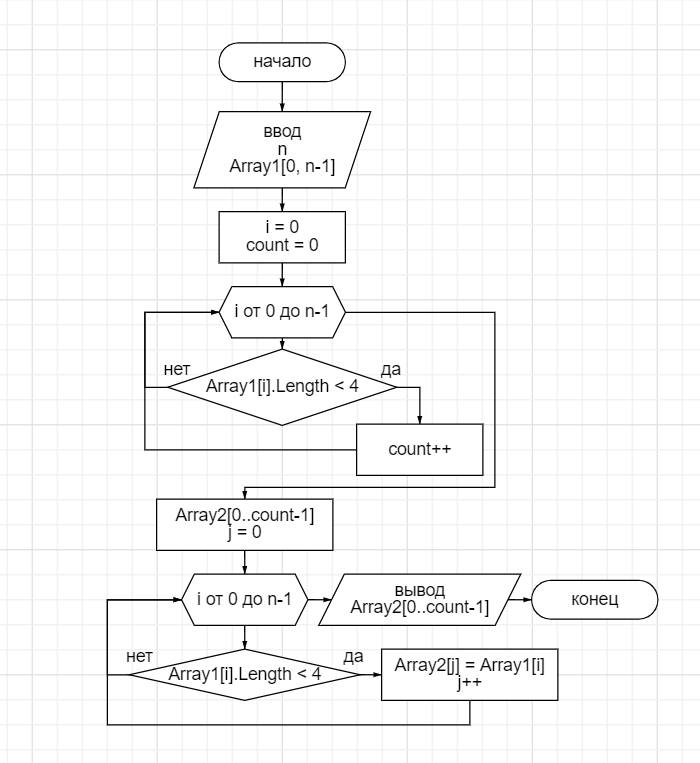

# Программа преобразования массивов
## 1. Задание

Напсать программу, которая из имеющегося массива строк формирует массив из строк, длина которых меньше или равна 3 символа.

## 2. Составление блок-схемы алгоритма

Блок-схема предоставлена на ниже 

## 3. Решение

Массив задаётся вручную. Для начала необхдимо узнать  количество значений в входящем массиве, которые меньще или равны 3 символам. Данное рещени осуществляется через цикл **for** и сравнение  через **if**. Итоговое значение (*count*) будет являтся количеством элементов выходного массива.

Следущим этапом создаётся второй массив (выходной), который наполняется значениями входного массива меньще или равны 3 символам. Рещени осуществляется также через цикл **for** и сравнение  через **if**.

